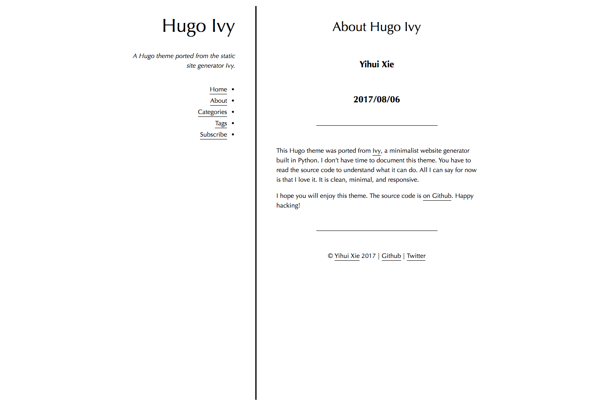

# My blog

This blog holds my notes/posts and other miscellaneous items.

It uses the Hugo theme that was ported from [Ivy](https://github.com/dmulholland/ivy), a minimalist website generator built in Python. Like Ivy, this theme is also released under [the Unlicense](https://en.wikipedia.org/wiki/Unlicense), which basically means you just do whatever you want.

Thanks to [Yihui Xie](https://github.com/yihui) for this beautiful, minimalist theme!

